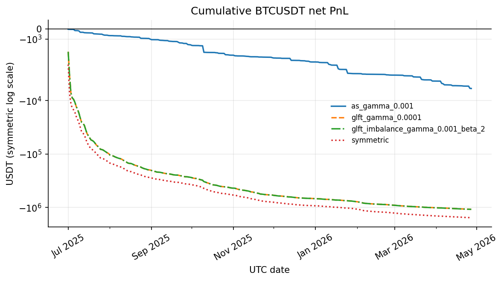
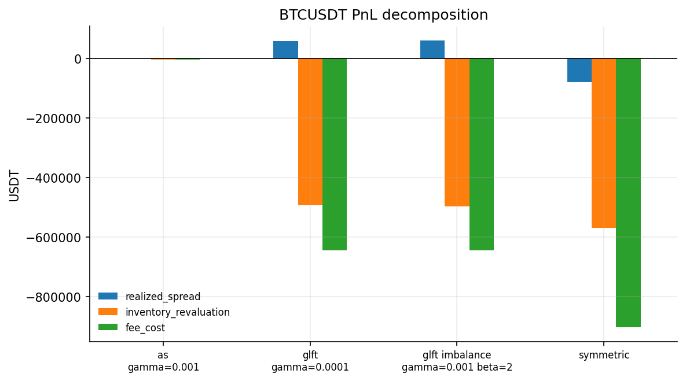
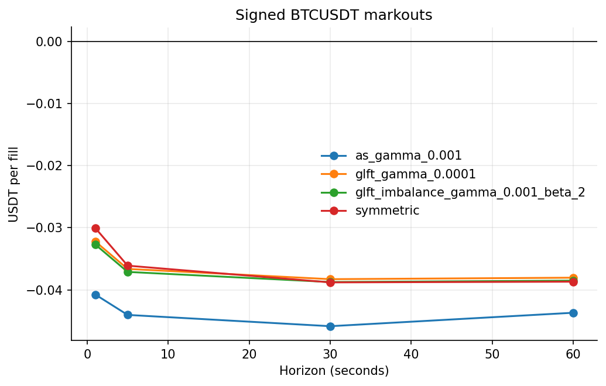
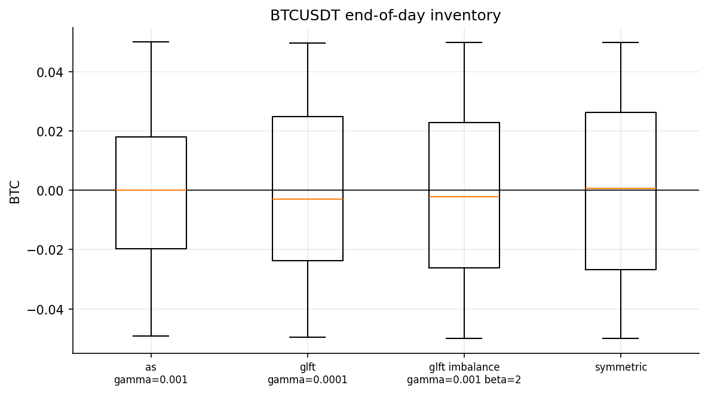
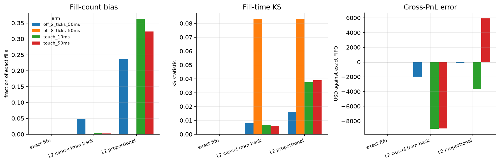

# P2: Market Making on Real Limit Order Books

[](https://github.com/pdwi2020/p2_market_maker/actions/workflows/ci.yml)
[](https://www.python.org/)
[](LICENSE)

**Question, fixed before any result was computed:** on real limit order books,
does inventory-aware quoting (Avellaneda-Stoikov, GLFT) plus a short-horizon
order-flow skew earn positive net PnL after queue position, latency, fees and
adverse selection? How much of the naive spread capture do markouts eat?

The protocol is in [`docs/preregistration.md`](docs/preregistration.md), written
and committed before the study ran, including every parameter grid, the
walk-forward split, and the rule for choosing the queue approximation. Later
changes are recorded as dated amendments with before-and-after tables.

## Result

**No.** Every preregistered strategy loses money in the locked test window, at
every fee and latency setting, and the loss is not mainly the fee. On BTCUSDT
the quoted spread is about **0.01 bp** of notional, while one-second adverse
selection runs **0.30 to 0.41 bp** and the maker fee is **2.0 bp**. The spread
is roughly two orders of magnitude too thin to pay for either.

BTCUSDT, 301 test days, maker 0.020%, latency 50 ms:

| Strategy | Net PnL | Ann. Sharpe | 95% CI | DSR | Fills | Gross, bp of notional | Profitable days |
| --- | ---: | ---: | ---: | ---: | ---: | ---: | ---: |
| symmetric touch | -1,548,538 | -33.75 | [-39.87, -30.06] | 0.00 | 16,489,122 | -1.29 | 0 of 301 |
| GLFT, gamma 1e-4 | -1,077,783 | -30.20 | [-36.52, -26.71] | 0.00 | 13,826,214 | -1.23 | 0 of 301 |
| GLFT + imbalance, beta 2 | -1,080,896 | -29.96 | [-36.26, -26.49] | 0.00 | 13,765,443 | -1.24 | 0 of 301 |
| Avellaneda-Stoikov, gamma 1e-3 | -5,915 | -6.53 | [-8.70, -5.51] | 0.00 | 68,870 | -1.52 | 17 of 301 |

Sharpe is annualised on daily net PnL at sqrt(365), with a bootstrap 95%
interval; DSR is deflated for the 31 preregistered trials. The
Avellaneda-Stoikov arm loses least because it barely trades: see the caveat
below.



Nothing in the sensitivity grid turns positive. Even at the rebate tier the
best cell is symmetric at -387,341:

| Maker fee | 10 ms | 50 ms | 200 ms |
| --- | ---: | ---: | ---: |
| -0.005% (rebate) | -421,169 | -420,469 | -387,341 |
| 0.000% | -648,916 | -646,083 | -600,191 |
| 0.010% | -1,104,409 | -1,097,311 | -1,025,891 |
| 0.020% (primary) | -1,559,902 | -1,548,538 | -1,451,592 |

Zero fees still lose 646,083, so fees are an aggravating term, not the cause.

### Where the money goes



| Strategy | Realized spread | Inventory revaluation | Fees | Net |
| --- | ---: | ---: | ---: | ---: |
| symmetric touch | -78,217 | -567,866 | 902,455 | -1,548,538 |
| GLFT, gamma 1e-4 | 58,955 | -492,981 | 643,758 | -1,077,783 |
| GLFT + imbalance | 60,528 | -497,175 | 644,249 | -1,080,896 |
| Avellaneda-Stoikov | 659 | -3,335 | 3,239 | -5,915 |

`fee_cost` is a positive magnitude, so the identity is realized spread plus
inventory revaluation **minus** fees, not a three-way sum.

The symmetric quoter's realized spread is **negative**, -0.047 bp per fill. A
touch quoter should buy below the midpoint and sell above it, so this is worth
stating plainly: with a 100 ms requote floor and 50 ms latency, the fills it
gets are disproportionately the ones where the midpoint has already moved
through its quote. It is being picked off faster than it can reprice. GLFT
quotes about 4 USDT off the midpoint yet realises only +0.043 bp, meaning the
midpoint has travelled nearly the whole way to its quote by the time it fills.
That is adverse selection measured directly rather than assumed.



Signed markouts are negative at every horizon for every strategy and most of the
damage is done within one second.

Inventory revaluation is the largest single negative term, and the reason is
visible in the end-of-day position:



End-of-day inventory has a median near zero and spans nearly the whole
permitted band over the 301 days, but it rarely closes at a bound: the
symmetric quoter finishes within a tick of the cap on 2 days out of 301.
Intraday is a different matter. Mean absolute inventory is 0.027 BTC against a
0.05 cap, so the symmetric quoter carries about **54%** of its permitted
position on average, and all three active strategies touch the cap at some
point on most days. The loss therefore comes from continuously marking a
position that is roughly half the bound, not from ending the day exposed.

### How much of this is the queue model?

The crypto book is level-two data, so queue position is modelled rather than
observed. The ES study replays the same quoting logic against order-level CME
MBO, where a hypothetical resting order's fills can be derived exactly, and
compares that truth against the two level-two approximations.



| Arm | Method | Fills | Fill-count bias | Gross PnL | Error vs exact |
| --- | --- | ---: | ---: | ---: | ---: |
| touch, 10 ms | exact FIFO | 68,478 | - | -73,262 | - |
| touch, 10 ms | L2 cancel-from-back | 68,774 | +0.4% | -82,312 | -9,050 |
| touch, 10 ms | L2 proportional | 93,363 | +36.3% | -76,894 | -3,631 |
| touch, 50 ms | exact FIFO | 63,198 | - | -75,462 | - |
| touch, 50 ms | L2 cancel-from-back | 63,372 | +0.3% | -84,487 | -9,025 |
| 2 ticks off, 50 ms | exact FIFO | 1,336 | - | +3,175 | - |
| 2 ticks off, 50 ms | L2 cancel-from-back | 1,400 | +4.8% | +1,187 | -1,987 |

Cancel-from-back was selected by the preregistered rule, on the preregistered
arm, before the crypto study ran. It overstates the gross loss by about **12%**
of the exact value at the touch. So the headline losses above are biased away
from zero by roughly that much, and correcting for it does not come close to
making any strategy profitable. The eight-ticks-off arm produced 12 fills in two
days, which is itself the finding: on ES, quoting that far out almost never
trades.

### Does an independent engine agree?

The same five days replayed through the external `hftbacktest` package, with
queue models matched (both advance only on traded volume):

| Date | Strategy | Native fills | External fills | Difference |
| --- | --- | ---: | ---: | ---: |
| 2025-07-07 | symmetric | 21,037 | 15,937 | -24.2% |
| 2025-08-04 | symmetric | 23,214 | 19,117 | -17.6% |
| 2025-10-06 | symmetric | 32,186 | 23,819 | -26.0% |
| 2026-01-05 | symmetric | 32,062 | 30,546 | -4.7% |
| 2026-04-06 | symmetric | 53,679 | 36,413 | -32.2% |
| 2025-07-07 | GLFT | 28,946 | 9,829 | -66.0% |
| 2026-01-05 | GLFT | 37,567 | 24,063 | -35.9% |

Both engines agree on the sign and rough scale, and the external engine is
consistently the more conservative. One modelling difference remains and
explains the gap's direction: the external exchange fills our single 0.01 BTC
order all or nothing, while the native engine allows a partial fill. That bites
hardest on GLFT, which rests away from the touch where passing volume is
thinner.

### Equity appendix

The same engine on the public AAPL LOBSTER sample, 2012-06-21, with 2012 Nasdaq
maker rebate assumptions:

| Strategy | Net PnL | Fills | Quoted width | Realized spread | Max abs inventory | Marketable fills |
| --- | ---: | ---: | ---: | ---: | ---: | ---: |
| symmetric touch | $16.80 | 1,970 | 1.99 bp | 1.55 bp | 10 | 0 |
| GLFT, gamma 1e-4 | $19.29 | 836 | 2.23 bp | 1.98 bp | 10 | 0 |
| Avellaneda-Stoikov | $9.55 | 342 | 3.66 bp | 1.69 bp | 6 | 0 |
| GLFT + imbalance | -$15.03 | 805 | 2.25 bp | 1.84 bp | 10 | 0 |

This is one symbol on one day and is not evidence of anything by itself, but it
isolates the mechanism. AAPL's quoted width is about **2 bp** against BTCUSDT's
**0.01 bp**, a factor of roughly two hundred, and the maker side is paid rather
than charged. The same code turns positive the moment the spread is wide enough
to cover adverse selection. The crypto result is about the venue's economics,
not about the quoting rules.

### A caveat on the Avellaneda-Stoikov arm

Its rolling session horizon of T = 86,400 s was fixed before the study ran. At
the calibrated volatility, the `gamma sigma^2 tau / 2` term makes its
half-spread about 447 USDT at session start, roughly 41 bp, and **99.2%** of its
quotes land deeper than the reconstructed 20-level book, where the replay
refuses to claim a fill. It is reported as preregistered rather than retuned
after the fact, but it should be read as a statement about that
parameterisation, not about inventory-aware quoting.

| Strategy | Quotes | On an empty level inside the book | Deeper than the book |
| --- | ---: | ---: | ---: |
| symmetric touch | 18,803,070 | 0.5% | 0.0% |
| GLFT, gamma 1e-4 | 19,365,350 | 88.3% | 0.2% |
| GLFT + imbalance | 44,585,570 | 88.0% | 0.1% |
| Avellaneda-Stoikov | 30,450,957 | 0.7% | 99.2% |


## Data

| Source | Coverage | Used for |
| --- | --- | --- |
| Bybit perpetual L2 book and trades | BTCUSDT, ETHUSDT, SOLUSDT, 2025-05-01 to 2026-04-27 | The main study |
| Databento CME MBO (ES.c.0) | 2025-01-06 and 2025-01-07, order level | Queue-model validation |
| LOBSTER level-10 sample (AAPL) | 2012-06-21 | Equity appendix |

The Bybit book arrives as snapshot and delta messages carrying 200 price levels
per side. Reconstruction replays them into a price-keyed book, checks that
`update_id` increases by one between deltas, marks the book invalid from a gap
until the next snapshot, asserts the book is never crossed, and caches the top
20 levels per side merged with the trade stream. Across the 532 reconstructed
symbol-days the crossed-book count is zero and there are no sequence gaps. Raw
data is never committed.

## Method

The replay is event driven over that reconstructed stream.

- **Post-only.** A quote that would be marketable when it becomes effective is
  repriced one tick inside the opposite touch. No preregistered path can take
  liquidity.
- **Queue position.** An order joins behind the displayed size at its price.
  Cancellations at that level advance it under the rule chosen by the ES study;
  trades advance it by their own volume.
- **Placement is one of three states.** `displayed` when the price carries size,
  `empty_level` when the price lies inside the reconstructed window but holds no
  size, in which case the order stands alone at the front, and `beyond_book`
  when the price is deeper than the deepest reconstructed level. A `beyond_book`
  order cannot fill: where the queue is unobservable the replay declines to
  invent one. Both counts are published per day.
- **Fills follow traded volume.** A trade at or through our price clears the
  queue ahead with its own volume and fills only the residual. Bybit prints one
  row per matched price level, best price first, so a sweep still fills the
  order completely, through its own volume rather than by assumption.
- **Latency** of 50 ms on submission, cancellation and replacement; a
  replacement loses priority. Quotes are reconsidered at most every 100 ms.
- **Inventory** is bounded to ±0.05 BTC by suppressing the side that would
  breach it. Nothing is flattened at day end; closing inventory is reported.
- **Fees** are 0.020% maker and 0.055% taker on absolute fill notional, with
  0.010%, 0% and −0.005% published as sensitivities alongside 10, 50 and 200 ms
  latency.

Parameters for day `d` are calibrated only from day `d−1`: sigma from one-second
midpoint changes, and `A` and `kappa` from a log-linear fit of trade-arrival
intensity against depth from mid. Strategy parameters were selected once on
2025-05-01 to 2025-06-30 and never touched again; the test window is
2025-07-01 to 2026-04-27.

## Reproduce

```bash
git clone https://github.com/pdwi2020/p2_market_maker.git
cd p2_market_maker
python3 -m venv .venv && source .venv/bin/activate
make install
make test
```

The test suite runs offline and needs no market data. Optional extras:

```bash
python -m pip install -e '.[external]'   # hftbacktest, for the cross-check only
python -m pip install -e '.[fast]'       # numba
python -m pip install -e '.[gpu]'        # torch, for make sweep
```

| Command | Purpose |
| --- | --- |
| `make test` | The full offline suite. |
| `make lint` | Static checks over source, tests and scripts. |
| `make download-lobster` | Fetch the public level-10 samples. |
| `make simulate` | The deterministic synthetic baseline and the 2008 replication. |
| `make replay` | The queue-aware AAPL replay. |
| `make research` | The full study; regenerates everything under `results/published/`. |
| `make figures` | Redraw the published figures from the published tables. |
| `make sweep` | The optional parameter sweep, GPU if Torch is present. |
| `make clean` | Remove build and test caches. |

`make research` needs the full history and a cache directory:

```bash
export P2_LAKE_DIR=/path/to/market_data
export P2_CACHE_DIR=/path/to/cache
make research
```

| Variable | Default | Purpose |
| --- | --- | --- |
| `P2_DATA_DIR` | `<repo>/data` | Downloaded samples. |
| `P2_CACHE_DIR` | `<repo>/.cache` | Reconstructed per-day caches. |
| `P2_LAKE_DIR` | unset | Full history; anything needing it skips when unset. |

### Provenance of the published results

The committed tables and figures come from one `make research` invocation on
CPython 3.13.8, macOS arm64, taking 5 hours 39 minutes wall clock with four
worker processes over a warm reconstruction cache. The package supports 3.11
through 3.13; CI exercises 3.11 and 3.12 on every push, without market data or
an external lake. Checked-in configurations carry fixed seeds, the sample
downloader prints SHA-256 for each archive, and relative paths resolve from the
repository root rather than the caller's working directory.

Per-day results are checkpointed under a fingerprint of the replay source, the
interpreter version and the NumPy version, so changing the engine invalidates
every cached day rather than silently mixing results from two code states.

## Repository layout

| Path | Contents |
| --- | --- |
| `src/p2/data/bybit.py` | L2 reconstruction, validation and caching. |
| `src/p2/data/mbo.py` | Order-level CME book and counterfactual resting orders. |
| `src/p2/bybit_replay.py` | The event-driven replay: post-only, queue, latency, fees. |
| `src/p2/research_models.py` | Calibration, AS and GLFT quotes, skew, PnL decomposition. |
| `src/p2/research_study.py` | Selection, the locked test window, checkpointing. |
| `src/p2/queue_validation.py` | Exact FIFO against the L2 approximations on ES. |
| `src/p2/hft_crosscheck.py` | The independent replay through `hftbacktest`. |
| `src/p2/lobster_appendix.py` | The equity appendix. |
| `src/p2/research_outputs.py` | The published table and figure contract. |
| `src/p2/hjb_solver.py`, `simulator.py`, `execution.py` | Closed-form quotes and the synthetic simulator. |
| `src/p2/glosten_milgrom.py`, `queue.py` | Adverse-selection and queue-reactive layers. |
| `docs/preregistration.md` | The protocol and its amendments. |
| `docs/hjb_derivation.md` | Ho-Stoll through AS, GLFT, queue-reactive and Glosten-Milgrom. |
| `results/published/` | The only committed results. |

## Limitations

- The result is a clean negative across 31 preregistered trials, three symbols
  and twelve fee and latency cells. It says the preregistered strategies do not
  work on this venue; it does not say market making on BTCUSDT is impossible.
  A maker who quotes selectively rather than continuously, or who holds a fee
  tier well below VIP0, is not described by this study.
- The queue approximation overstates the gross loss by about 12% of the exact
  value on ES, measured on two days.

- Single venue, single contract. No funding payments: the event stream does not
  carry them.
- The L2 queue approximation is a model. Its error against order-level truth is
  measured on ES and published, but ES is not Bybit and two days is not a
  distribution.
- The reconstruction keeps 20 levels per side, so quotes deeper than that cannot
  fill. This binds hardest on the Avellaneda-Stoikov arm.
- The external cross-check fills our order all or nothing while the native
  engine allows a partial fill; queue models are matched but fill policies are
  not.
- Counterfactual replay ignores our own market impact: a resting order that
  would have absorbed an aggressor changes nothing about the recorded tape.
- Book and trade feeds are independent channels, and 38.8% of trade events print
  outside the touch of the last preceding book snapshot. That is partly genuine
  sweeping and partly the book lagging the trade that moved it; the
  reconstruction does not separate them.
- The LOBSTER appendix covers AAPL alone. The sample host no longer serves the
  other four archives.

## References

- Avellaneda, M. and Stoikov, S. (2008). High-frequency trading in a limit order book. *Quantitative Finance* 8(3).
- Ho, T. and Stoll, H. R. (1981). Optimal dealer pricing under transactions and return uncertainty. *Journal of Financial Economics* 9(1).
- Guéant, O., Lehalle, C.-A. and Fernandez-Tapia, J. (2013). Dealing with the inventory risk. *Mathematics and Financial Economics* 7.
- Cont, R., Kukanov, A. and Stoikov, S. (2014). The price impact of order book events. *Journal of Financial Econometrics* 12(1).
- Huang, W., Lehalle, C.-A. and Rosenbaum, M. (2015). Simulating and analyzing order book data: the queue-reactive model.
- Glosten, L. R. and Milgrom, P. R. (1985). Bid, ask and transaction prices in a specialist market with heterogeneously informed traders. *Journal of Financial Economics* 14(1).
- Bailey, D. H. and López de Prado, M. (2014). The Deflated Sharpe Ratio.
- `hftbacktest`: <https://hftbacktest.readthedocs.io/>

## License

MIT. See [LICENSE](LICENSE).
