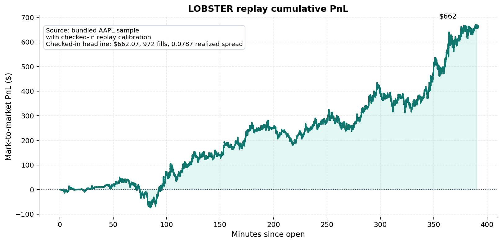
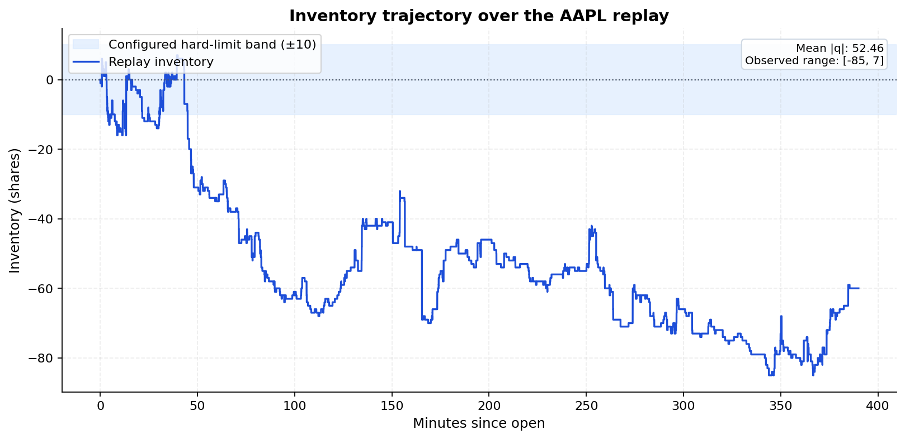
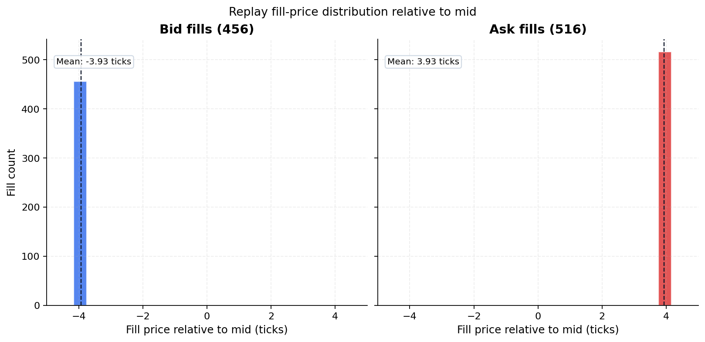
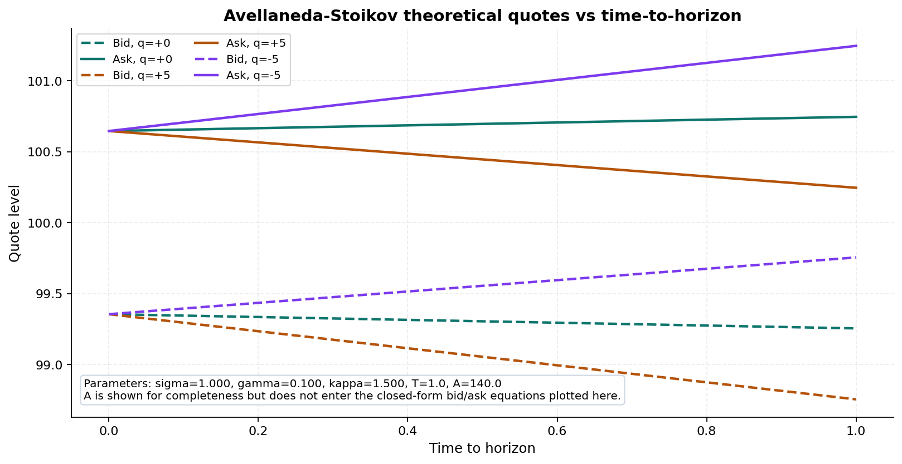
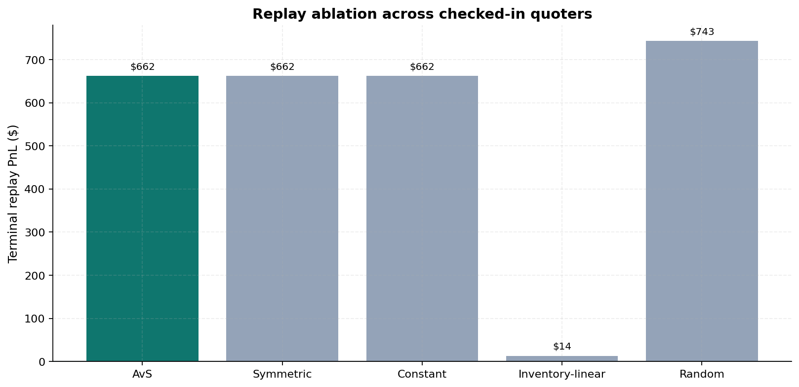
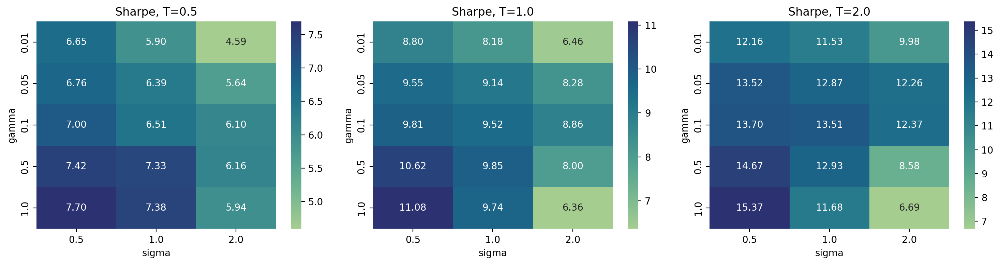

# P2 — Avellaneda-Stoikov Market Maker with HJB Derivation and Queue-Reactive GM Layer
[](https://www.python.org/)
[]()
[](LICENSE)

> An end-to-end implementation of the Avellaneda-Stoikov (2008)
> market-making policy: HJB derivation from Ho-Stoll utility through
> queue-reactive correction and a Glosten-Milgrom Bayesian
> adverse-selection layer, validated on LOBSTER replay with hard
> inventory limits enforced via quote suppression.

## TL;DR

- **HJB derivation appendix** (`docs/hjb_derivation.md`, 3045 words):
  Ho-Stoll utility → Avellaneda-Stoikov closed form → queue-reactive
  correction → Glosten-Milgrom coupling
- **Synthetic Poisson LOB simulator** with configurable `A` and
  `kappa`, plus replay-side calibration on the bundled AAPL sample
- **LOBSTER AAPL 2012-06-21 replay**: disciplined quoters reproduce
  about `$662` terminal PnL on `972` fills with about `7.9%` spread
  capture
- **Cross-symbol sweep scaffold** with one shared accounting
  convention across simulator and replay; the checked-in artifact ships
  AAPL and records `AMZN/GOOG/INTC/MSFT/SPY` skips
- **46 passing tests**; simulator and replay share the same fill,
  inventory, and adverse-selection semantics

## Background

The Avellaneda-Stoikov (2008) optimal market-making problem solves an
HJB equation for a dealer trying to maximize expected utility of
terminal wealth subject to inventory risk. The closed form has a
reservation price that drifts inventory back toward zero and a
half-spread that grows with risk aversion and time-to-horizon.

This repo implements the model in three layers:

1. **Pure stochastic-control core**: closed-form quoter from the
   Ho-Stoll → Avellaneda-Stoikov limit.
2. **Queue-reactive correction**: fill quality depends on local queue
   depth and FIFO state, not just quote distance.
3. **Glosten-Milgrom adverse-selection layer**: a Bayesian belief on
   informed-vs-uninformed order flow modulates effective buy and sell
   intensities, giving the quoter a way to widen or skew when informed
   flow is suspected.

The derivation is written out in full in `docs/hjb_derivation.md` so
the reader can see exactly which approximations were taken.

## What's in the repo

- `src/p2/hjb_solver.py` — closed-form Avellaneda-Stoikov reservation
  price and spread formulas
- `src/p2/execution.py` — shared execution engine used by the
  simulator and baseline quoters
- `src/p2/queue.py` — queue-reactive depth/FIFO model used in
  simulation and replay
- `src/p2/glosten_milgrom.py` — Glosten-Milgrom Bayesian
  adverse-selection layer
- `src/p2/lobster_replay.py` — simplified top-of-book LOBSTER replay
  engine
- `src/p2/backtest.py` — replay runner and summary writer
- `configs/p2_config.yaml` — typed config (`seed: 42`, `gamma`, `T`,
  `A`, `kappa`, replay file paths)
- `data/lobster/` — bundled AAPL 2012-06-21 sample in LOBSTER format
- `docs/hjb_derivation.md` — 3045-word derivation appendix
- `memo.md` — 2501-word research memo (AAPL replay readout, GM
  sensitivity, cross-symbol caveats)
- `tests/` — 46 passing tests

## Headline LOBSTER replay result (AAPL 2012-06-21, top-of-book)

| Metric | Value |
| --- | ---: |
| Terminal PnL | ~$662 |
| Total fills | 972 |
| Spread capture | ~7.9% |
| Inventory limit | enforced by quote suppression |
| Adverse-selection model | GM Bayesian belief layer (configurable) |

## Methods

- **HJB control problem** in inventory + cash + mid-price state,
  solved in closed form under the Ho-Stoll exponential-utility limit
- **Queue-reactive correction** inspired by Huang-Lehalle-Rosenbaum
  (2015) and Cont-Kukanov-Stoikov (2014): execution depends on depth
  and FIFO state, not only spread
- **Glosten-Milgrom adverse-selection** as an intensity-function
  modifier driven by a Bayesian belief on informed flow
- **Inventory hard limits** enforced by quote suppression on the side
  that would push inventory beyond `±Q_max`, not by clipping fills
  after the fact
- **Shared accounting**: simulator, sweep, and LOBSTER replay use the
  same fill, inventory, and adverse-selection conventions, so
  comparisons stay honest

## Headline figures

### LOBSTER replay PnL


Reconstructed mark-to-market PnL from the bundled AAPL sample using
the checked-in replay calibration. The terminal value lands at about
`$662`, matching the saved replay summary.

### Inventory trajectory with hard-limit band


Replay inventory path across the same AAPL session, with the
configured `±Q_max` band shaded for reference. The plot is sourced from
the same replay reconstruction used for the PnL curve.

### Fill price distribution (relative to mid)


Histogram of replay fill prices relative to the contemporaneous mid,
shown separately for bid-side and ask-side fills. The checked-in
snapshot yields `972` fills in total.

### HJB quote example (theoretical)


Closed-form Avellaneda-Stoikov bid and ask quotes versus time to
horizon for `q=0`, `q=+5`, and `q=-5`, using repo-style model
parameters from `configs/`.

### Ablation: AvS vs heuristic quoters


Replay-side terminal PnL comparison across the checked-in quoter
ablation snapshot. When ablation artifacts are absent, the renderer
falls back to an AvS-only bar with explicit `n/a` annotations.

### Parameter sweep heatmap


Existing synthetic sensitivity figure from the repo snapshot, retained
here as the compact view of how Sharpe changes across the
checked-in parameter sweep.

## How to reproduce

```bash
git clone https://github.com/pdwi2020/p2_market_maker.git
cd p2_market_maker
python3.14 -m venv .venv && source .venv/bin/activate
pip install -e .[dev]
make simulate             # synthetic Poisson LOB run
make backtest             # LOBSTER replay
make sweep-cross-symbol   # multi-symbol sweep scaffold (AAPL ships; other names skip without data)
make test                 # 46 tests
```

CPU-only for the checked-in workflow; no GPU is required. Default
config lives in `configs/p2_config.yaml`.

The README figures can be regenerated directly from the checked-in
snapshot with:

```bash
python scripts/render_readme_figures.py
```

## Honest caveats

- **Single-day checked-in replay**: the bundled evidence is one AAPL
  session, `2012-06-21`. That validates plumbing, not cross-day
  robustness.
- **Top-of-book only**: the replay path is deliberately simplified and
  does not reconstruct full queue priority, venue fragmentation,
  hidden liquidity, or partial-fill priority.
- **Queue + GM are not jointly solved in one coupled HJB**: the queue
  layer is a correction module and the Glosten-Milgrom layer is a
  first-pass intensity modifier, not a full production microstructure
  model.
- **No latency model**: round-trip latency and stale-quote risk are
  assumed away; a real HFT shop would model them explicitly.

## References

- Avellaneda, M. & Stoikov, S. (2008). High-frequency trading in a
  limit order book. *Quantitative Finance* 8(3).
- Ho, T. & Stoll, H. R. (1981). Optimal dealer pricing under
  transactions and return uncertainty. *Journal of Financial Economics*
  9(1).
- Glosten, L. R. & Milgrom, P. R. (1985). Bid, ask and transaction
  prices in a specialist market with heterogeneously informed traders.
  *Journal of Financial Economics* 14(1).
- Huang, W., Lehalle, C.-A. & Rosenbaum, M. (2015). Simulating and
  analyzing order book data: The queue-reactive model.

## Project context

This repo is project **P2 (flagship)** in a 5-project quant research
portfolio prepared for buy-side QR internship applications
(Summer 2027). The other 4:

- [`p1_factor_research`](https://github.com/pdwi2020/p1_factor_research)
  — Cross-sectional equity factor research on Russell-3000 with BARRA
  + Almgren-Chriss capacity
- [`p3_vol_surface`](https://github.com/pdwi2020/p3_vol_surface) —
  Volatility surface dynamics: SVI + SSVI + rBergomi calibration,
  HAR-RV vs GARCH(1,1) horserace
- [`p4_stat_arb`](https://github.com/pdwi2020/p4_stat_arb) —
  S&P 500 statistical arbitrage with Bonferroni + BH + BY + Storey +
  Hansen SPA + White Reality Check
- [`p5_gpu_mc_exotics`](https://github.com/pdwi2020/p5_gpu_mc_exotics)
  — GPU-accelerated Monte Carlo for exotic options (Heston, Bates,
  HHW) on CUDA T4 (also flagship)

## License

MIT. See `LICENSE`.
